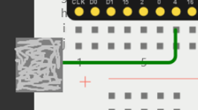

# CustomerCounterESP32
# Prosa Customer Counter

## 1. Introduktion
Dette program kører på en ESP32, der fungerer som en webserver, og gør det muligt at styre og interagere med enheden via en webbrowser. Når enheden tændes, starter den med at hoste en webside kaldet `wifimanager.html`, som fungerer som en WiFi manager. Her kan brugeren indtaste et SSID og et password for at få en forbindelse til et WiFi-netværk.

Når ESP32'en har opnået en stabil WiFi-forbindelse, skifter den til at hoste `index.html`. Denne side viser en graf, der henter og viser data fra en **CSV-fil**, som ESP32'en gemmer lokalt på sit filsystem. Grafen opdateres automatisk baseret på de data, den modtager fra en **HTTP-anmodning**. På den måde kan brugeren få visualiseret data direkte på webbrowseren.

Derudover indeholder systemet en services.html, som giver brugeren mulighed for at tilføje, fjerne og administrere data på en nem og intuitiv måde via hjemmesiden. Denne side kan bruges til at tilføje nye data, fjerne data eller endda slette hele filen, hvilket gør det muligt for brugeren at administrere de gemte oplysninger uden at skulle bruge en ekstern computer.

Alt i alt gør dette program det muligt for brugeren at administrere WiFi-forbindelser og interagere med gemte data på en enkel og effektiv måde direkte fra en webbrowser, med al kommunikation og lagring håndteret af ESP32'en selv.

Det her program kan bruges som en simulation af en sensor som tæller hvor mange kunder som er gået ind i en butik.

---

## 2. Materials
Her er der en liste af alle de komponenter der blir brugt.

    1 Arduino Mega 2650
    1 Breadboard
    1 Ledning
    1 Sølvpapir

---

## 3. Program Struktur og logik
### Brugte Pins
* Touch Pin GPIO4 / 4

### Touch og dens funktion
  
**Touch Sensoren** skal bruges til at simulere at en kunde er trådt ind i butikken. Når den bliver aktiveret skriver ESP32 det ned i CSV filen med datoen og tid den registrede aktiveringen.

---
## 4. Funktioner i koden
Programmet har mange funktioner som hvert gør deres ting for at få det hele til at køre.

### Funktioner i main.cpp
* **Initialize LittleFS**:  `void initLittleFS()`

    Sætter LittleFS op.
---
* **Read Config Files**:  `String readConfigFiles(fs::FS &fs, const char * path)`

    Bruges til at læse **Config** filerne `ssid.txt` og `pass.txt`
---
* **Read CSV File**:  `const char* readCsvFile(fs::FS &fs, const char * path)`

    Bruges til at læse `customer-list.csv` filen.
---
* **Write to Config Files**:  `void writeToConfigFiles(fs::FS &fs, const char * path, const char * message)`

    Bruges til at skrive data ned i **Config** filerne `ssid.txt` og `pass.txt`
---
* **Append to CSV**:  `bool appendToCSV(const char * path, String currentDate, String currentTime)`

    Bruges til at tilføje data i **Csv Filen** `customer-list.csv`
---

* **Remove Latest Entry on Date**:  `bool removeLatestEntryOnDate(const char * path, String targetDate)`

    Bruges til at fjerne den seneste tilføjet værdi for den givet dato i **Csv Filen** `customer-list.csv`
---

* **Remove Lines with Date**:  `bool removeLinesWithDate(const char* path, const String& inputDate)`

    Bruges til at fjerne alle linjer hvor datoen matcher med den givet dato i **Csv Filen** `customer-list.csv`
---

* **Clear File**:  `bool clearFile(const char* path)`

    Bruges til at slette alt i en fil så den bliver helt tom. Den sletter ikke filen.
---

* **Initialize WiFi**:  `bool initWiFi()`

    Bruges til at tilslutte et netværk med en SSID og et Password som brugeren har givet.
---

* **Count Dates**:  `String countDates(const char* csv)`

    Bruges til at tælle hvor mange linjer har en dato som matcher med den givet dato i **Csv Filen** `customer-list.csv`
---

* **Get Time**:  `String getTime(tm timeInfo)`

    Bruges til at få den nuværende tid i en `HH:MM` format
---

* **Get Date**:  `String getDate(tm timeInfo)`

    Bruges til at få den nuværende dato i en `YYYY/MM/DD` format
---

* **On Touch Event**:  `void onTouch()`

    Bruges når **Touch Sensoren** er blevet aktiveret. Den tager den nuværende dato og tid ved brug af funktionerne `getDate(&timeInfo)` og `getTime(&timeInfo)`. Efter det så kalder den funktionen `appendToCsv(csvPath, date, time)`.
---

* **Setup**:  `void setup()`

    Sætter **Serial** op med Baud rate på 115200 og kører funktionen `initLittleFS()`. Efter det prøver den at tilslutte et WiFi med `initWiFi()`. Hvis det er muligt hoster den **index.html filen** på den givet **IP** adresse som den har fået fra det tilsluttet WiFi.
    Den sætter derefter en webserver op med forskellige **HTTP Request** håndteringer op som hjemmesiden så kalder. 

    Hvis det ikke er muligt så laver den et **AP (Acces Point)** og hoster **wifimanager.html**. Derinde kan brugeren så skrive et SSID og et Password som den så skriver ned med `writeToConfigFiles()` funktionen. Efter det genstarter den **ESP32'en**
---

* **Loop**:  `void loop()`
    
    tjekker hele tiden om **Touch Sensoren** er blevet aktiveret.
---

### Funktioner i index.html
* **Fetch Date Counts** `fetchDateCounts()`

    Bruges til at hente data fra webserveren ved brug **HTTP Request**.
---
* **Render Chart** `renderChart(data)`

    Bruges til at splitte dataen i **Counts** og **Dates** og så lave en graf med den data.
---

### Funktioner i Services.html
* **Send Request** `sendRequest(serviceUrl, method = 'POST')`
    Bruges til at sende **HTTP Request** til webserveren i ESP32.
---